[Home](/)

# Meijster Distance in Kotlin

Let's say we have a transparent image (of a croissant, for example) and want to apply a white outline to make it look better.

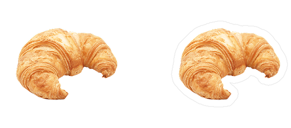

There are many ways to go about this, of course. However, one of the most efficient can be found in [this paper](https://fab.cba.mit.edu/classes/S62.12/docs/Meijster_distance.pdf). "A general algorithm for computing transformations in linear time", it sounds promising!

Scrolling through this paper, we can see that it's not that long (only 10 pages), it has pseudo code that seems easy enough to implement and it contains loads of graphs... So let's implement it!

## What does that paper have to do with our outlined-croissant?

The paper describes how to compute efficiently something called the Meijster distance. The Meijster distance is used to create what's called a [distance transform](https://en.wikipedia.org/wiki/Distance_transform) or distance field. In our case, it will be the distance of each pixel to the closest non-transparent pixel of my source image. All pixels that are non-transparent are part of the sticker image and should have a distance of 0. All other pixels should have a distance strictly greater than 0.

With this distance transform computed, all we need to do is to draw a white pixel if the distance is less than a given threshold, or leave the pixel transparent otherwise. That should give us the effect we're looking for.

Since we're using terms like "for each pixel", it really sounds like it should be computed on the GPU. But for now, the goal is just to understand the algorithm, so let's make a pure Kotlin implementation first.

## Performance considerations

What's interesting about the Meijster distance algorithm is that it can be pretty well parallelized. Each pixel is not exactly independent, but it's possible to do two passes: one for each column and one for each row. So if running perfectly in parallel, the overall time complexity will be O(number of rows + number of columns).

Since I'm doing this on the CPU, this implementation is O(n), with n being the number of pixels.

## Overall approach

The algorithm's input in our case is a Bitmap (that can be seen as a 2D array, with each value representing a pixel's color). Let's say we have the image that looks a bit like a croissant 🥐, like in the next figure.

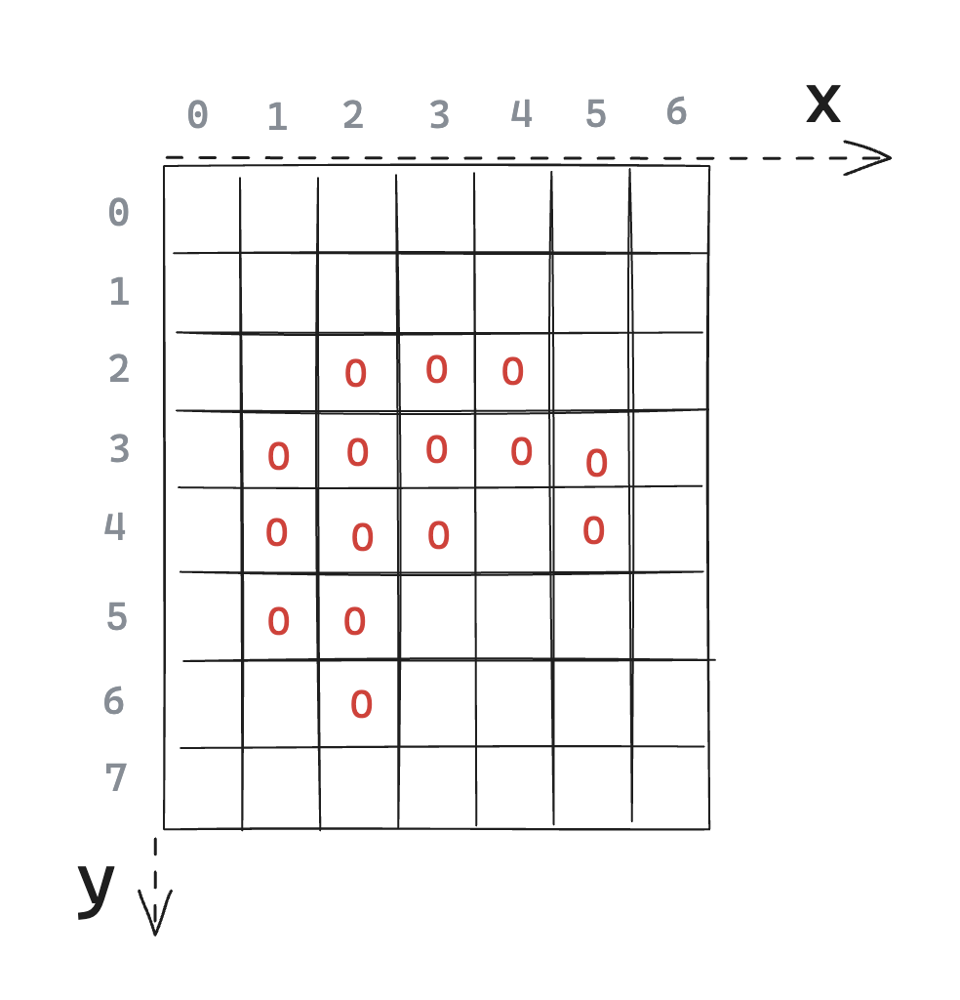

*Figure A: Bitmap of a croissant, where all pixels inside the image are marked with a red O, and all transparent pixels are left blank*

The Meijster distance transform is computed in 4 steps: the first two steps iterate over columns and the last two iterate over rows.
- In steps 1 & 2, we take a given column and iterate through each pixel. First from top to bottom and then from bottom to top. The goal here is to calculate the "vertical distance" of each pixel to the closest non-transparent pixel.

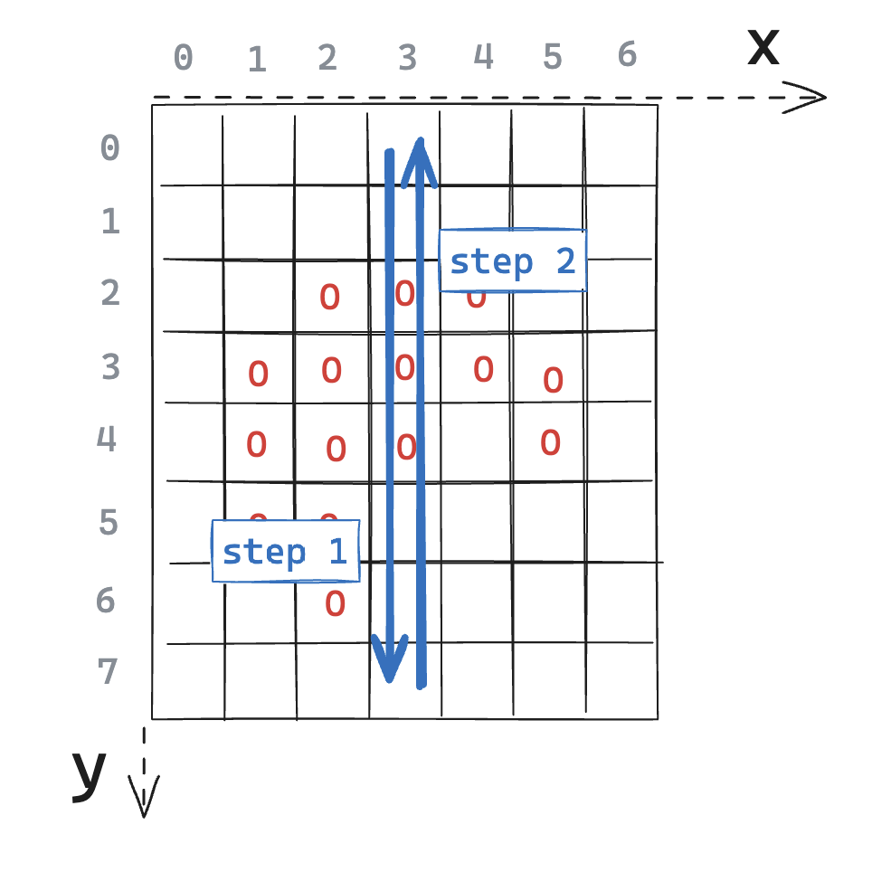

*Figure B: Steps 1 and 2, for the column at x=3. All other columns can also be processed independently*

- Steps 3 & 4 build upon the output of the previous steps. This time, they iterate over rows: first from left to right and then from right to left. The goal of step 3 is to compute the "lowest envelope" for the row, and step 4 uses it to compute all distances.

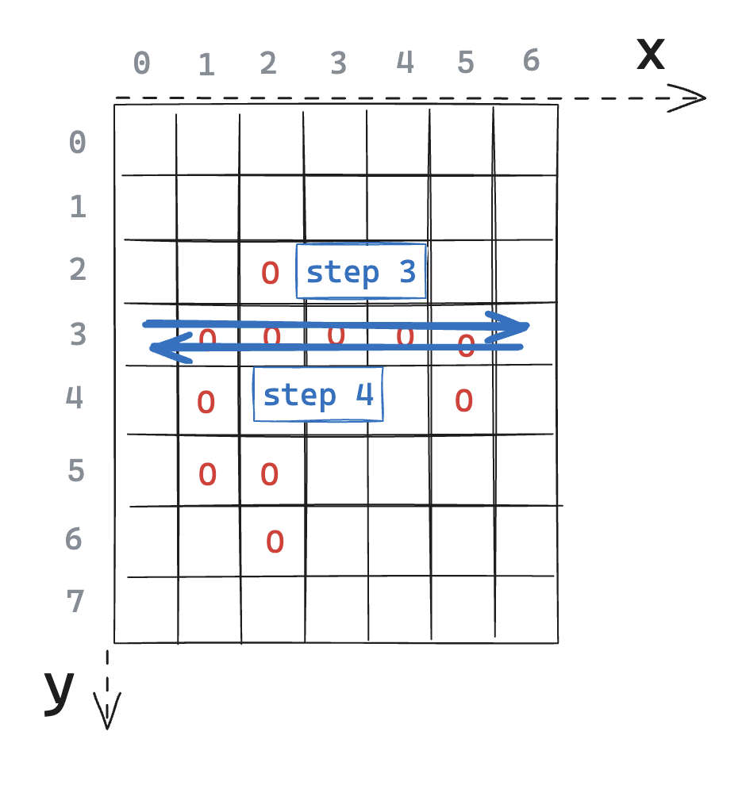

*Figure C: Steps 3 and 4, for the row at y=3. All other rows can also be processed independently*

The output will also be something that looks like a Bitmap, but each value represents a distance instead of a color. So to avoid confusion, I'll create a `IntBuffer2d` type to hold the output.

```kotlin
class IntBuffer2d(val width: Int, val height: Int) {
    val buffer = IntArray(width * height) { 0 }

    operator fun get(x: Int, y: Int): Int = buffer[y * width + x]
    operator fun set(x: Int, y: Int, value: Int) {
        buffer[y * width + x] = value
    }
}
```

We'll set the `IntBuffer2d`'s `width` and `height` to the same values as the source Bitmap, and use the setter to set the distance value of each pixel.

Here is what we expect our algorithm to return for our current example:

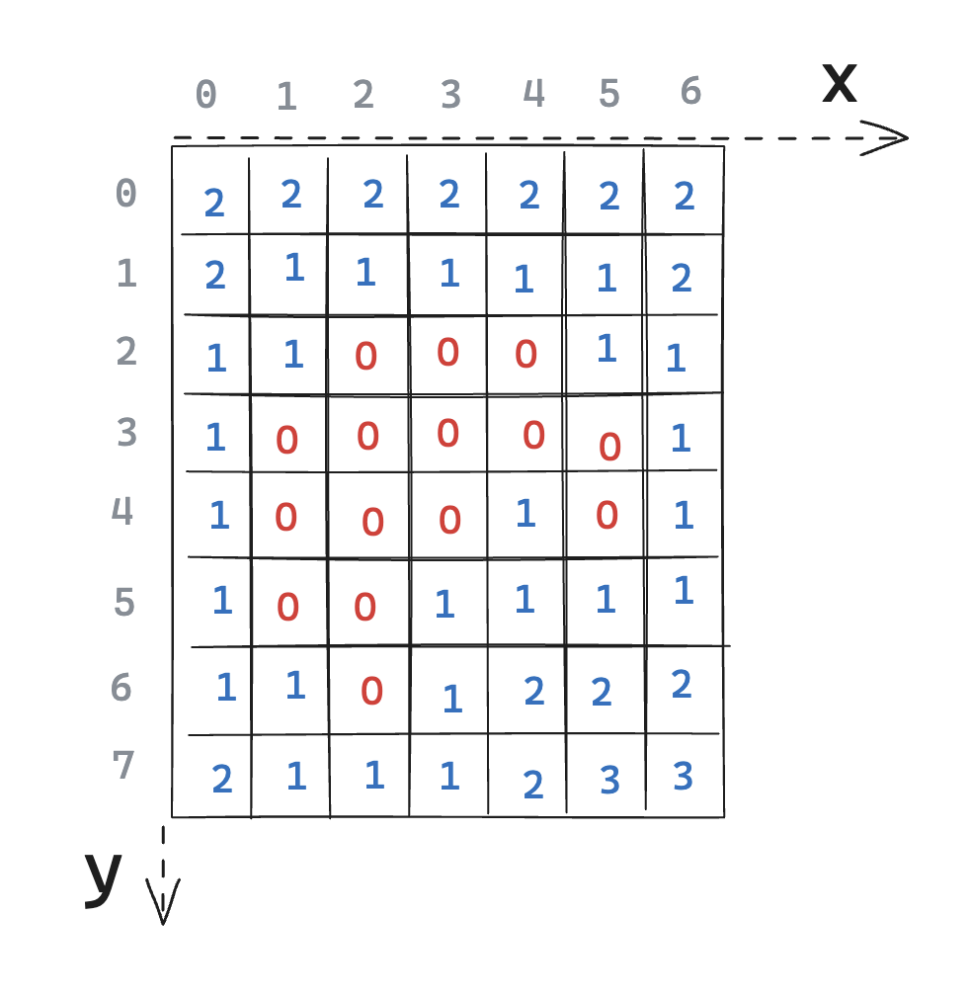

*Figure D: Example output for our example. Here I'm using what's called the chessboard distance, but in our algorithm we'll use the more classical Euclidean distance, which is the distance formula we usually think of when talking about distances*

Now that we have the overall approach, let's go into the details for each step.

## Steps 1 & 2: Computing the vertical distance

Let's start by creating a `g` buffer to store the vertical distances.

```kotlin
val g = IntBuffer2d(width, height)
```

Now since we're doing this in Kotlin, we'll loop over each column (once again, on GPU this could be parallelized).

```kotlin
for (x in 0..(width - 1)) {
    // Compute column x here
}
```

Inside this loop, we will iterate over y for each row, first from top to bottom.
And for each pixel in the column:
- If the current pixel is non-transparent, set the vertical distance to 0
- Otherwise, set it to 1 + the vertical distance of the pixel above

This will give us the vertical distance to the closest non-transparent pixel that is above the current pixel.

Note that we also need to take care of the first pixel independently.

```kotlin
if (!isTransparent(x, 0)) {
    g[x, 0] = 0
} else {
    g[x, 0] = infinity
}

for (y in 1..(height - 1)) {
    if (isTransparent(x, y)) {
        g[x, y] = (1 + g[x, y - 1]).coerceAtMost(infinity)
    }
}
```

The `isTransparent(x, y)` function returns true if the pixel of the source image is transparent.

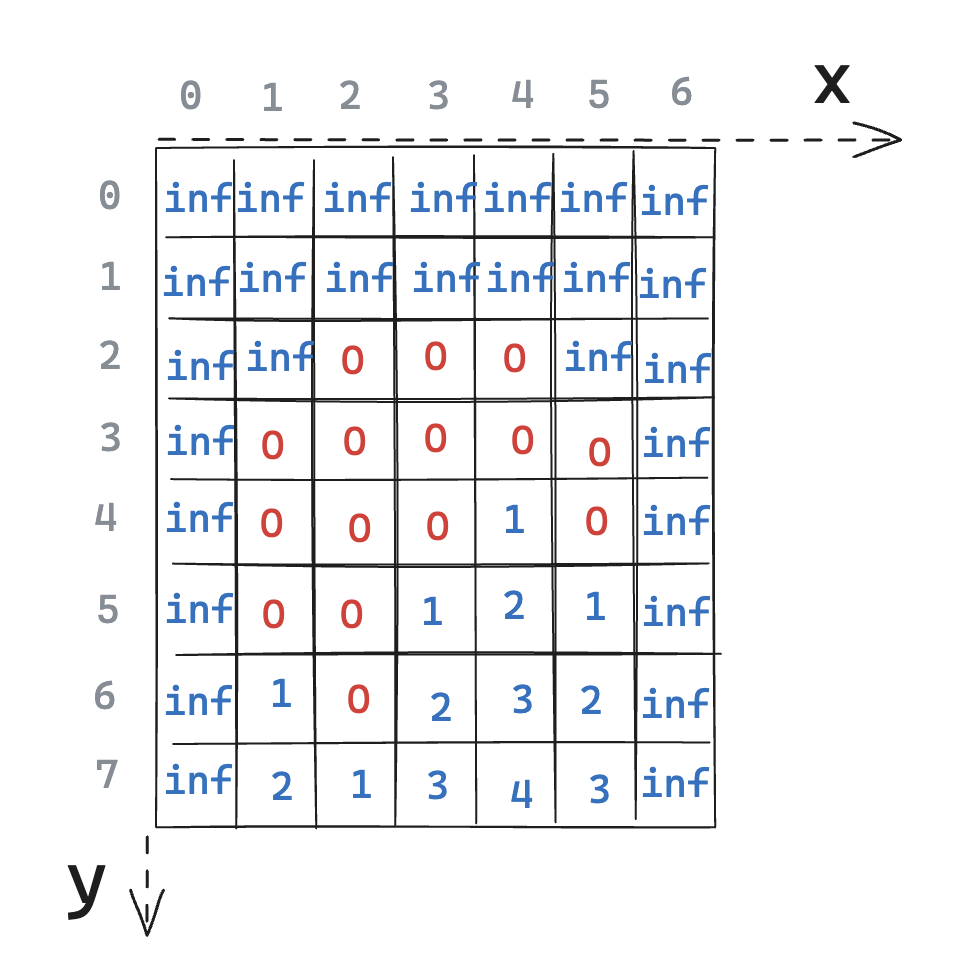

*Figure E: Vertical distance to the closest non-transparent pixel above*

Now let's use these values to compute the actual vertical distance. This can be achieved by iterating from bottom to top, and for each pixel in the column:
- If the vertical distance is higher than the pixel below, then set it to 1 + vertical distance of pixel below

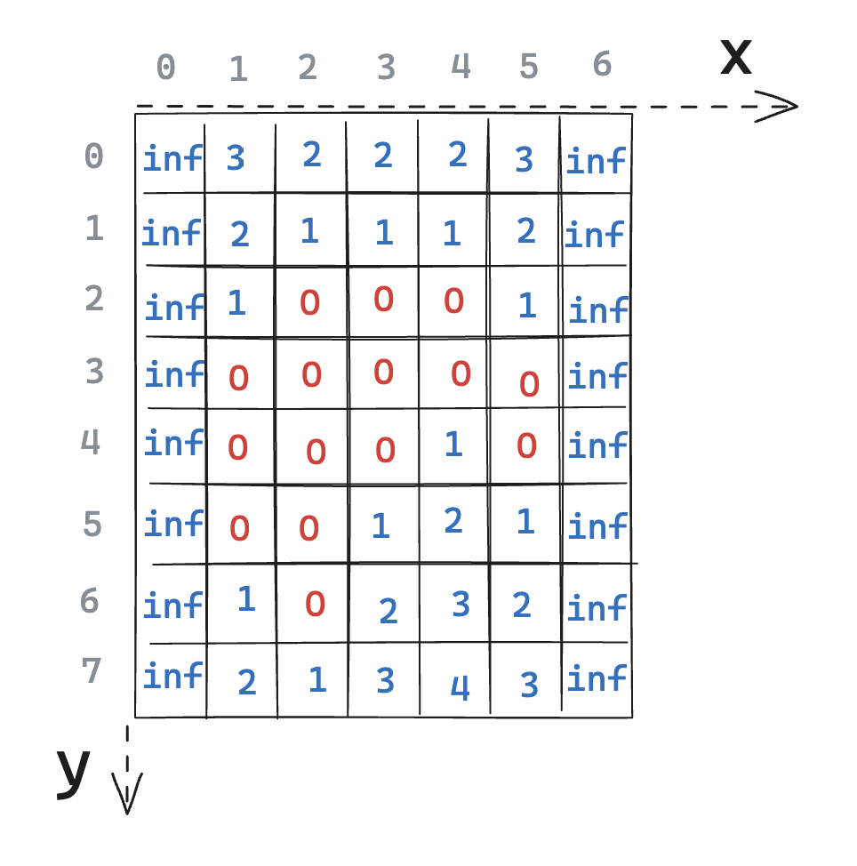

*Figure F: Vertical distance to the closest non-transparent pixel above or below*

So far, so good! We already have something that looks like a distance transform. It's just not very precise. You can see that pixels left and right of the image are considered extremely far (infinite). This is because we only looked at each column independently. Next, we'll take a look at rows. However, the approach will not be so simple: for a given pixel, to make sure that we actually have the closest distance, we need to consider all other columns in the given row.

## Steps 3 & 4 - Creating and using the lowest envelope

As mentioned before, steps 3 and 4 run on each row independently. So let's take a specific row and look at what we should do.

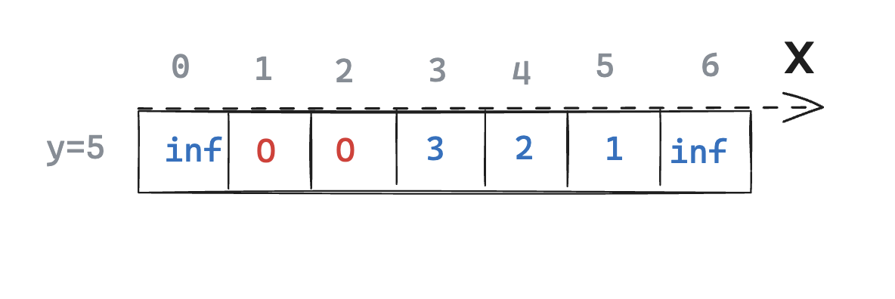

*Figure G: Row y=5 of our buffer, slightly modified for it to be more interesting*

Now each value of the row represents the distance to the closest non-transparent pixel on the vertical axis. We can use it to compute the actual distance.

### The Euclidean distance function f

Let's define some terms for our Euclidean distance. To compute the distance between point A(xa, ya) and point B(xb, yb), we can introduce a 3rd point P(i, j) where `i = xb` and `j = ya`. It's easier to see with an image.

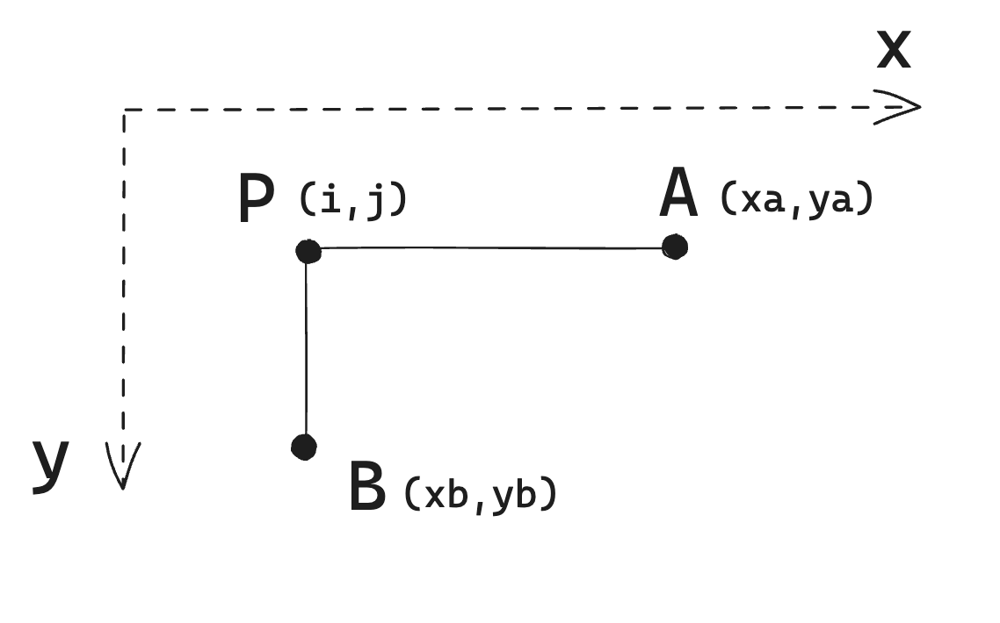

*Figure H: Reminder of some basic school geometry*

Pivot point P helps us to write the distance calculation: the distance AB is the square root of (AP)^2 + (BP)^2. For simplicity, let's drop the square root, as it doesn't really matter in our case. Now let's apply this to our problem.

We can define a function `f` that returns the distance of the point A=(x, y) to the closest non-transparent pixel (that we call here B), but going through P=(i, y):

```kotlin
fun f(x: Int, i: Int): Int {
    return (x - i) * (x - i) + g[i, y] * g[i, y]
}
```

Since A(x, y) and P(i, y) are on the same row, the distance AP is `|x - i|`. P(i, y) and B(i, yb) are on the same column, and the distance between them has been calculated in steps 1 & 2 and stored in `g[i, y]`.

### Calculating a single distance-curve

Now that we have a concept of pivot point P(i, y), it's useful to see what happens if we fix this pivot point P and take different points A on the row. Said differently, for each pixel of the row, what is the closest distance that goes through pivot point P?

In the next figure, we are still on the row y=5, and have chosen arbitrarily a pivot point at i=4: P(4,5). Now let's compute `f(x, i) = f(x, 4)` for all x. For this to be easier to see, let's plot it in a graph:

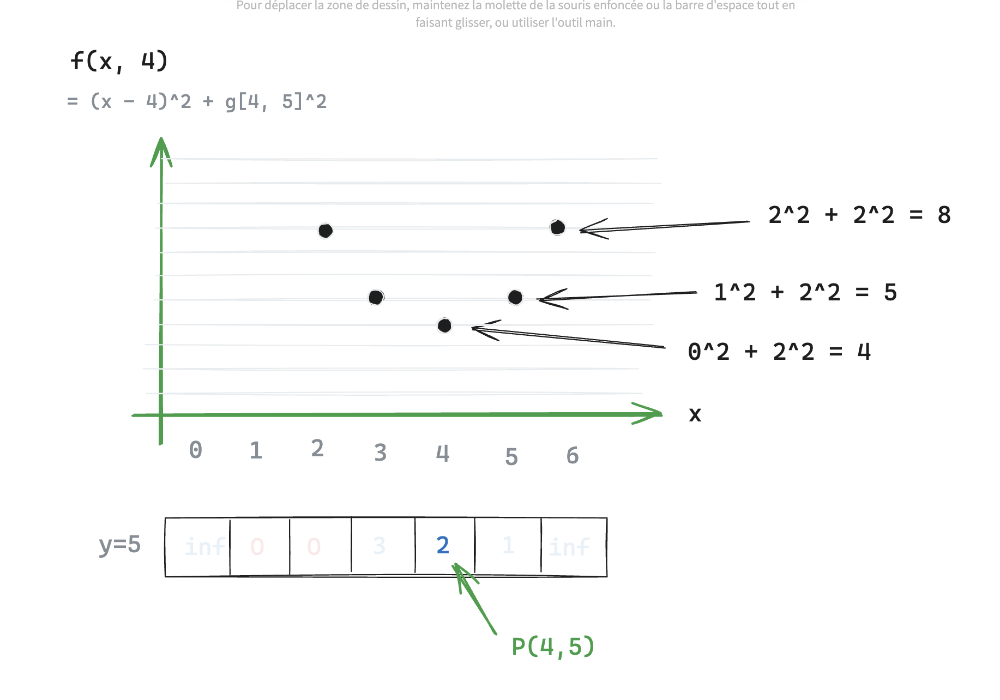

*Figure I: Graph of f(x, i) for the pivot point at i=4*

The curve is a parabola, which is to be expected given the quadratic formula of `f`. For simplicity, let's draw this curve as a line. We can call it "distance-curve" for the pivot point at i=5.

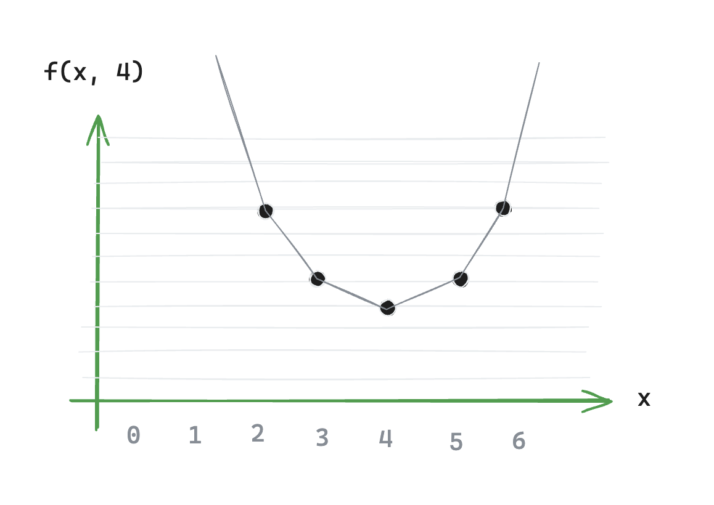

*Figure J: Distance-curve for the pivot point at i=4*

### The lower envelope

Now the next step is to consider all distance curves for all possible pivot points. That puts that in a graph.

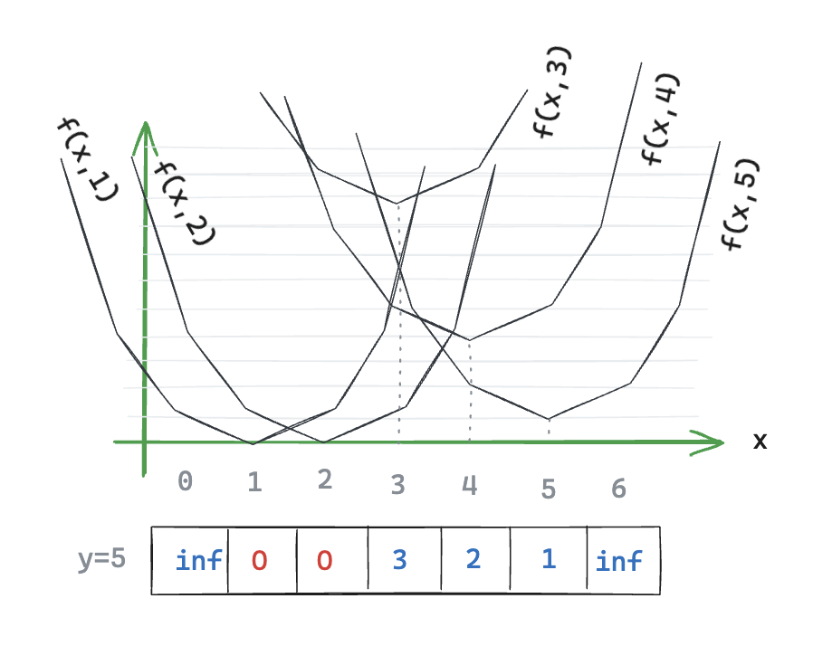

*Figure K: All distance-curves for the row*

That's a mess. But it does highlight something interesting, we can highlight the lower part of the combined curves, to form a new curve: the lower envelope.

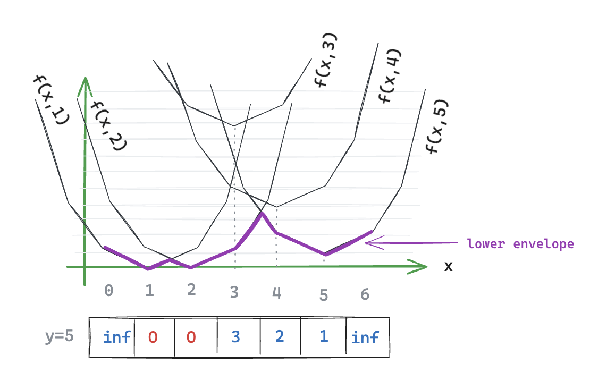

*Figure L: All distance-curves for the row, with the lower envelope highlighted*

What's special about this lower envelope is that it represents the distance for each x to the closest non-transparent pixel, going through all possible pivot points. That's exactly what we're looking for, isn't it?

For a given `x` (let's say x=4), we can look at the lower envelope and find which is the current "best" distance-curve. With this, we know which pivot point to use to have the minimum distance.

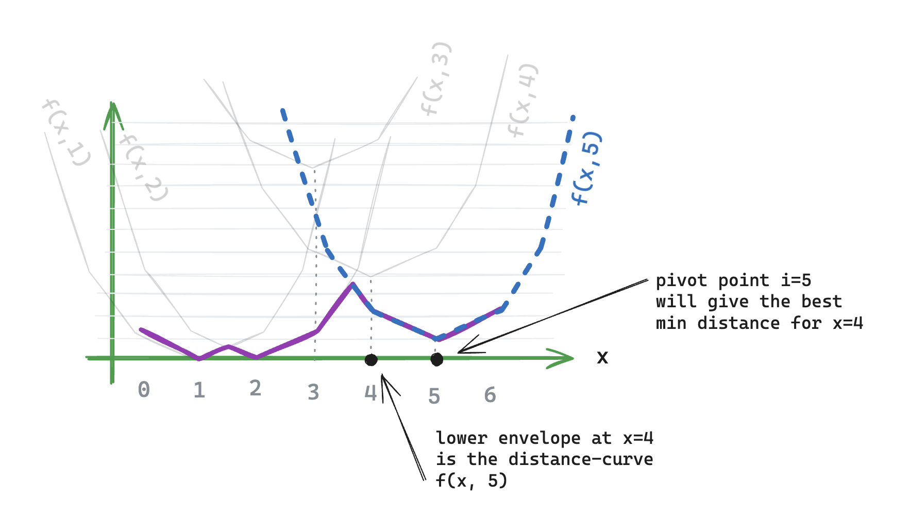

*Figure M: For x=4, the distance-curve that is part of the lower envelope is for pivot point i=5*

### Putting this in code

The first problem we need to solve is how to represent this lower envelope in code. Assuming that we know exactly what the lower envelope is, what should it look like in memory?

To answer this question, we can go back to our example. We notice that not every distance-curve takes part in the lower envelope. In our example, only the curves of pivot points i=1, i=2, and i=5 are part of it. To be more precise, we can see exactly which distance-curve is being used for each value of x:
- For x=0 and x=1, it's the distance-curve i=1
- For x=2 and x=3, it's the distance-curve i=2
- For x=4, x=5, and x=6, it's the distance-curve i=5

Said differently, the lower envelope is:
- The distance-curve of i=1 starting at x = 0
- The distance-curve of i=2 starting at x = 3
- The distance-curve of i=5 starting at x = 6

In code, we can represent the lower envelope with two arrays:
- An array `s`, which stores pivot points of each curve taking part in the lower envelope
- An array `t`, which stores the starting point where the distance curve becomes the "best"

```kotlin
val s = IntArray(width) { 0 }
val t = IntArray(width) { 0 }
```

For our example, we'll have at the end:

```kotlin
s = [1, 2, 5] // pivot points
t = [0, 3, 6] // starting points
```

Now we don't know how to compute this yet, but let's see how this is useful first.

### Step 4: Using the distance curve (right to left)

Assuming that `s` and `t` have been computed, and that we have `q`, the index of the "last" distance curve (aka the size of `s` - 1).

Then we can iterate from right to left in the row, and compute the distance of each pixel:
- `s[q]` is the index of the pivot point that will give the best distance, so for the pixel at (u,y), the result of `f(u, s[q])` is what we're looking for.
- When decrementing u, if we reach the start point of the current distance-curve (aka `t[q]`), we switch to the previous distance-curve. This allows us to always stay on the curve

```kotlin
for (u in (width - 1) downTo 0) {
    out[u, y] = f(u, s[q]) // using s[q] as pivot point gives the min distance (per definition)

    if (u == t[q]) {
        // we reached the starting point of the current distance-curve
        // switch to the previous distance curve of the lower envelope
        q--
    }
}
```

Note that `out` is the output of our algorithm: the actual distance of each pixel to the closest non-transparent pixel. It is created as follows:

```kotlin
val out = IntBuffer2d(width, height)
```

As we can see, this step was pretty straightforward. Now, all that remains is to actually create `s`, `t`, and `q`.

### Step 3: Creating the lower envelope

To create the lower envelope, we'll iterate an index u on the whole row:

```kotlin
for (u in 1..(width - 1)) {
    (...)
}
```

Now the plan here is to create the lower-envelope iteratively. We'll start with an empty lower envelope and add distance-curves one by one, using index u. Every time we add a distance-curve, we'll update the lower envelope accordingly.

For example, the lower envelope after adding the u=3 should look like this:

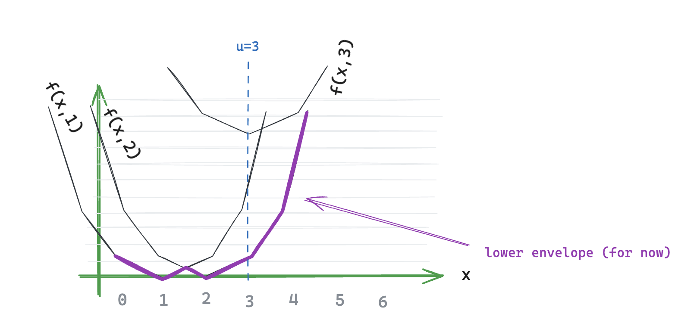

*Figure N: Lower envelope after adding u=3, it's not completed yet*

When adding a new distance-curve there are 3 possible cases (it's what's represented in the 1st figure of this post, so let's use it again 😉)
- Case 1) The u-th distance-curve is better than the whole previous lowest-envelope; we replace everything
- Case 2) The u-th distance-curve is worse than the whole previous lowest-envelope; we ignore it
- Case 3) The u-th distance-curve intersects the previous lowest-envelope; we update it

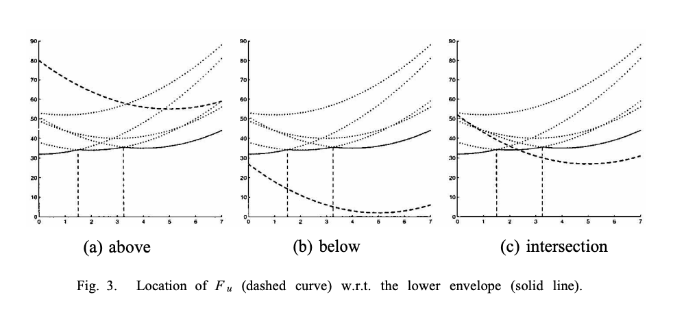

Here is what it looks like in code:

```kotlin
// Search for an intersection between the u-th distance-curve and the lowest envelope
while (q >= 0 && f(t[q], s[q]) > f(t[q], u)) {
    q--
}

if (q < 0) {
    // case 1) we replace everything
    q = 0
    s[0] = 0
} else {
    val w = 1 + sep(s[q], u)
    if (w < width) {
        // case 3) intersection, we update accordingly
        q++
        s[q] = u
        t[q] = w
    }
    // case 2) we ignore the u-th distance curve (do nothing)
}
```

The tricky part is calculating the intersection point for case 3, which is what the `sep` function does. The paper explains it pretty well, and the calculus is not too complicated. In our case, `sep` looks like this:

```kotlin
fun sep(i: Int, u: Int): Int {
    return (sq(u) - sq(i) + sq(g[u, y]) - sq(g[i, y])) / (2 * (u - i))
}
```

And well, that's it. We run this code for each u, going incrementally, and when `u` reaches the end, we know we have the lower envelope. We already know how to use it, so that's about it.

## Conclusion

We implemented the Meijster distance algorithm, which gets us the distance of each pixel to the closest non-transparent pixel. We then use this distance to draw a white border on the image. For a 500x500 image on a Pixel 8, this code runs in about 8ms. It's way too slow to draw every frame (it will almost block one CPU core), but can be used for one-off calculations.

The next logical step is to introduce some parallelization here. Optimally, this should be done on the GPU. I might try to parallelize it a bit on the CPU first, to see what kind of performance we can achieve there.

Here is [the complete Kotlin code on GitHub](https://gist.github.com/thalkz/8f1fe88a1a9e2964ba335725a0b5